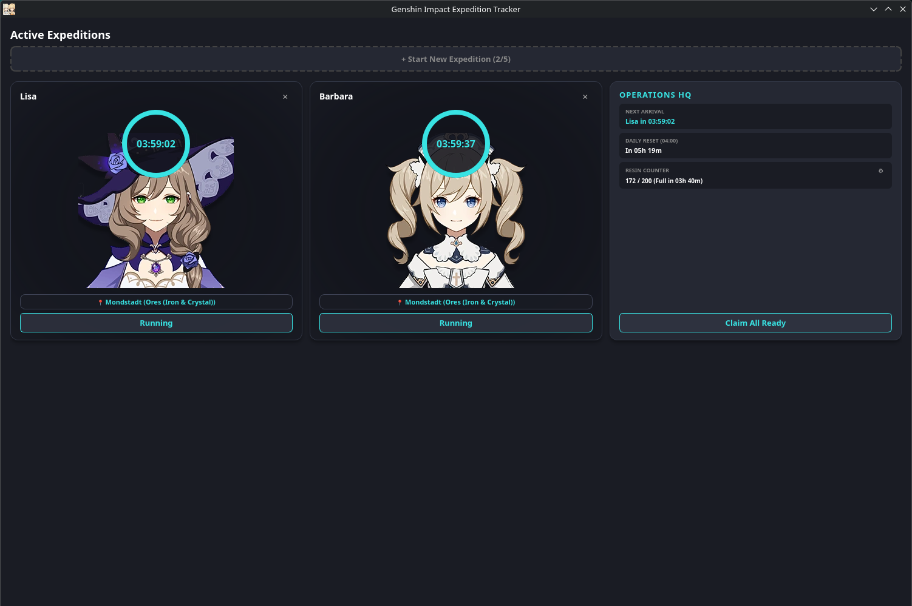
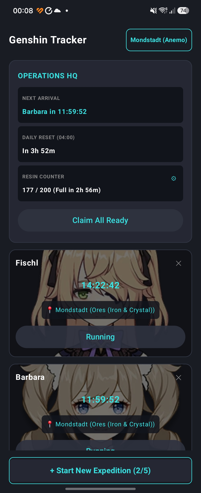

# Genshin Impact Expedition Tracker

A cross‑platform tracker for expeditions in Genshin Impact, available as a **PyQt6 desktop application** and as a **native Android app** built with Jetpack Compose.

---

## Features

### Desktop (PyQt6)

- **Live Ring Timer:** Circular progress indicators for active expeditions.
- **Character Bonuses:** Automatically detects characters with 25% time reduction (e.g., Bennett, Fischl, Chongyun, Keqing, Kujou Sara).
- **Desktop Notifications:** Notifies via `plyer` when an expedition is completed.
- **Operations HQ:** Shows the next upcoming expedition, daily server reset (04:00), and a resin counter.
- **Claim All:** Collect all completed expeditions at once.
- **Persistence:** Expedition data is automatically saved in `expeditions.json` and restored on next launch.
- **Character Icons:** Background images of characters are loaded from the `assets/characters/` folder (optional).
- **Regional Themes:** Choose between seven Teyvat regions (Mondstadt, Liyue, Inazuma, Sumeru, Fontaine, Natlan, Snezhnaya) that customize the entire color scheme of the app.
- **System Tray:** Minimize to tray and continue running in the background.
- **Autostart:** Option to start with the system (Windows registry or Linux `.desktop` file).
- **Teyvat Journal:** Daily commissions, weekly bosses, Katheryne, Parametric Transformer, artifact route, and endgame star counters (Abyss & Theater).
- **Crafting Calculator:** Alchemy & crafting bench calculator with passive character bonuses (Sucrose/Albedo, Mona/Xingqiu).
- **Wish & Pity Counter:** Track pity, guaranteed status, primogems, and fates.
- **Resin Planner:** Shows time until full resin cap and warning time.
- **Weekly Boss Tracker:** Manage half‑resin discounts and defeated bosses.
- **Team & Farming Goals:** Plan talent book farming schedule for up to 4 characters.



### Android (Jetpack Compose)

- **Native UI:** Modern Material 3 design with dark theme.
- **Expedition Management:** Add, view, and delete expeditions with a clean card layout.
- **Resin Counter:** Shows current resin (regenerates 1 every 8 minutes) and time until full charge.
- **Daily Reset Timer:** Shows time until next server reset (04:00).
- **Notifications:** Uses Android's `WorkManager` to schedule a notification when an expedition ends.
- **Persistence:** Expedition and resin data are stored in `SharedPreferences` and restored on next launch.
- **Character Images:** Dynamically loads character drawables from app resources.
- **Regional Themes:** Choose between seven Teyvat regions (Mondstadt, Liyue, Inazuma, Sumeru, Fontaine, Natlan, Snezhnaya) that customize the entire color scheme of the app.
- **Crafting Calculator:** Built‑in calculator for alchemy and crafting materials.
- **Wish & Pity Counter:** Track pity and savings for wishes.
- **Weekly Boss Tracker:** Manage half‑resin discounts and defeated bosses.



---

## Installation & Getting Started

### Desktop (Python)

#### Prerequisites

- Python 3.8 or higher
- pip (Python package manager)

#### Install Dependencies

```bash
pip install PyQt6 plyer
```

#### Clone Repository

```bash
git clone https://github.com/sonictriplex/genshin-expedition-tracker.git
cd genshin-expedition-tracker
```

#### Download Character Icons (optional)

Run the included script to download the 93 character icons from Fandom:

```bash
python download_genshin_icons.py
```

#### Start the Program

```bash
python main.py
```

### Android

#### Prerequisites

- Android Studio (latest version recommended)
- Android SDK 26+ (minSdk = 26)
- Gradle 9.5 (included in wrapper)

#### Build & Run

1. Open the `android/` folder in Android Studio.
2. Let Gradle sync and download dependencies.
3. Connect a device or start an emulator (API 26+).
4. Click Run (▶) or execute:

```bash
cd android
./gradlew installDebug
```

---

## Usage

### Desktop

1. Click „+ Start New Expedition“ to create a new expedition.
2. Choose a character, region, resource, and duration.
3. The ring timer shows the remaining countdown.
4. Once an expedition is completed, a desktop notification appears (if `plyer` is installed).
5. Click „Claim Reward“ or „Claim All Ready“ in the Operations HQ to collect the reward.
6. Data is automatically saved and restored on next launch.
7. Switch Theme: Select a region from the dropdown menu in the top right to customize the entire color scheme of the app.
8. System Tray: Close the window to minimize to tray; use the tray icon to reopen or quit.
9. Sidebar Navigation: Use the left sidebar to switch between Expeditions, Teyvat Journal, Crafting Calculator, Wish & Pity Counter, Resin Planner, Weekly Boss Tracker, Team & Farming Goals, and Settings.

### Android

1. Tap „+ Start New Expedition“ to open the add dialog.
2. Choose a character, region, resource, and duration (4/8/12/16/20 hours).
3. The card shows a live countdown and the character image.
4. When the timer reaches zero, the card displays „READY!“ and a notification is sent.
5. Tap „Claim Reward“ to remove the expedition.
6. Use the Operations HQ card to see the next arrival, daily reset, and resin counter.
7. Tap the gear icon next to RESIN COUNTER to manually adjust resin.
8. Switch Theme: Tap the region name in the top right to customize the entire color scheme of the app.
9. Use the bottom navigation to access Tracker, Journal, Crafting, Wishes, and Bosses screens.

---

## Project Structure

```
genshin-expedition-tracker/
├── assets/
│   └── characters/                  # Character icons / images
├── android/                         # Android Studio project root
│   └── app/src/main/java/com/mediamatrix/genshintracker/
│       ├── Expedition.kt            # Data models, constants & SharedPrefs logic
│       ├── ExpeditionWorker.kt      # WorkManager for background timer & notifications
│       ├── MainActivity.kt          # UI, adapters & main app logic
│       ├── NotificationHelper.kt    # Notification channel & builder
│       ├── Screens.kt               # Additional Compose screens (Crafting, Wishes, Bosses)
│       └── ui/theme/                # Material theme definitions
├── config.py                        # Themes, paths, character data & cross-platform autostart
├── crafting.py                      # Crafting Calculator widget (Desktop)
├── dialogs.py                       # Overlay dialogs (Add Expedition, Resin, Settings)
├── journal.py                       # Teyvat Journal widget (Desktop)
├── main.py                          # Main window, system tray & app entry point
├── resin_planner.py                 # Resin Planner widget (Desktop)
├── team_goals.py                    # Team & Farming Goals widget (Desktop)
├── translations.py                  # Central translation file (German & English)
├── weekly_bosses.py                 # Weekly Boss Tracker widget (Desktop)
├── widgets.py                       # Custom UI widgets (ExpeditionCard, OperationsHQCard)
├── wishes.py                        # Wish & Pity Counter widget (Desktop)
├── download_genshin_icons.py        # Helper script to download character icons
├── expeditions.json                 # Auto-created save file (Desktop)
└── README.md                        # Project documentation & Git info
```

---

## Translations

The central translation file `translations.py` contains all UI strings for the desktop application. It currently supports **German** and **English** and can easily be extended with additional languages.

---

## License & Disclaimer

This project is licensed under the MIT License.

- **Assets & IP:** All character icons, game graphics, and related material are property of HoYoverse.
- This project is an unofficial, non‑commercial fan tool created under HoYoverse's Fan‑Art Policy. It is not endorsed, supported, or sponsored by HoYoverse.
- README.md optimized with Aider
